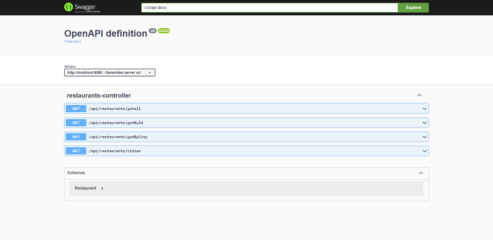
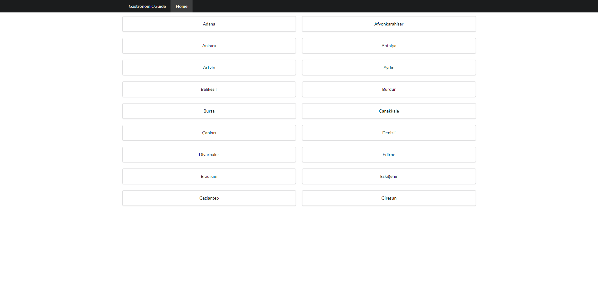
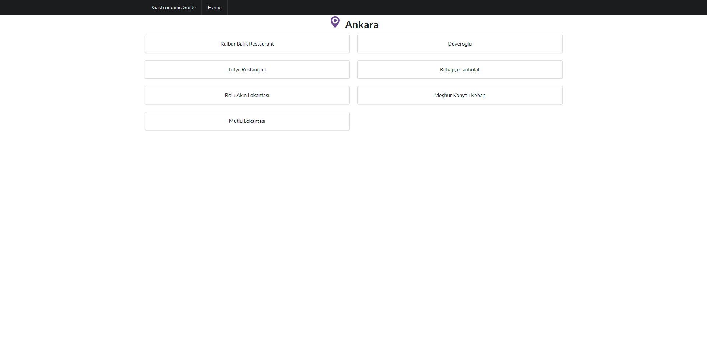
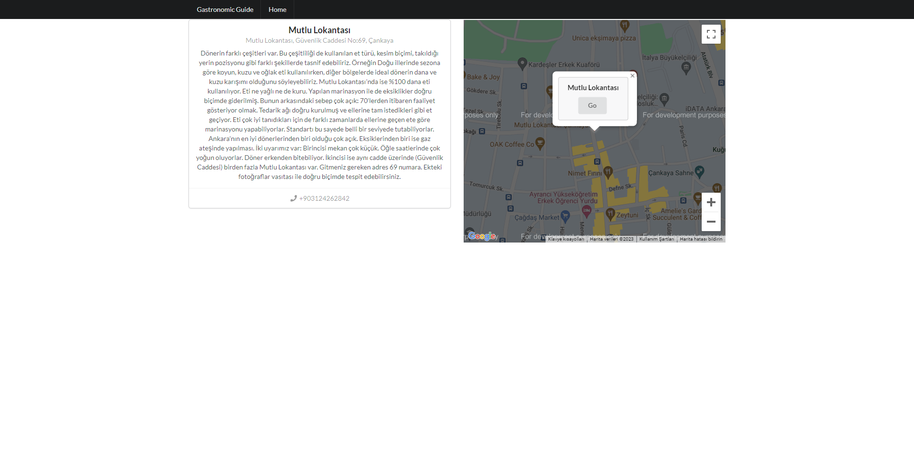

# Gastronomic Guide

The Gastronomic Guide is a web-based application developed with the objective of offering an accessible, user-friendly platform for users to explore restaurants across various cities, view detailed information about each restaurant, and see the location of selected restaurants on a map. Additionally, a unique feature of the application allows users to create a route on the map by clicking on the marker and pressing the 'Go' button. For a more immersive experience, the application also provides a street view feature that allows users to virtually navigate the vicinity of the restaurant. Each restaurant is rated by the renowned food critic Vedat Milör, ensuring users have a trusted guide for their culinary journeys.


## Languages Used

- Frontend: JavaScript (React.js) 
- Backend: Java (Spring Boot) 
- Database: SQL (PostgreSQL)

## Photos
*Swagger UI*

*Home Page*

*City Page*

*Restaurant Page*



# Installation Guide

This guide assumes that you have already cloned the repository and navigated into the project directory.

## Prerequisites

Ensure you have the following installed on your local development machine:

- Java JDK 11 or higher
- Node.js 
- Maven (the project uses Maven wrapper, so it's optional)
- An IDE such as IntelliJ IDEA, Eclipse or VSCode

## Backend Installation

1. **Navigate into the backend directory**:

    ```bash
    cd backend
    ```

2. **Build the project**:

    This project uses Maven for dependency management. If you have Maven installed, you can use:

    ```bash
    mvn install
    ```

    Alternatively, you can use the Maven wrapper included in the project:

    ```bash
    ./mvnw install
    ```

3. **Run the project**:

    ```bash
    ./mvnw spring-boot:run
    ```

    This will start the Spring Boot application. By default, it should run at `http://localhost:8080` go to `http://localhost:8080/swagger-ui/index.html` for Swagger UI.

## Frontend Installation

1. **Navigate into the frontend directory**:

    ```bash
    cd ../frontend
    ```

2. **Install dependencies**:

    We use `npm` for dependency management. Install the dependencies with:

    ```bash
    npm install
    ```

3. **Start the application**:

    ```bash
    npm start
    ```
    This will start the React application. By default, it should run at `http://localhost:3000`.
